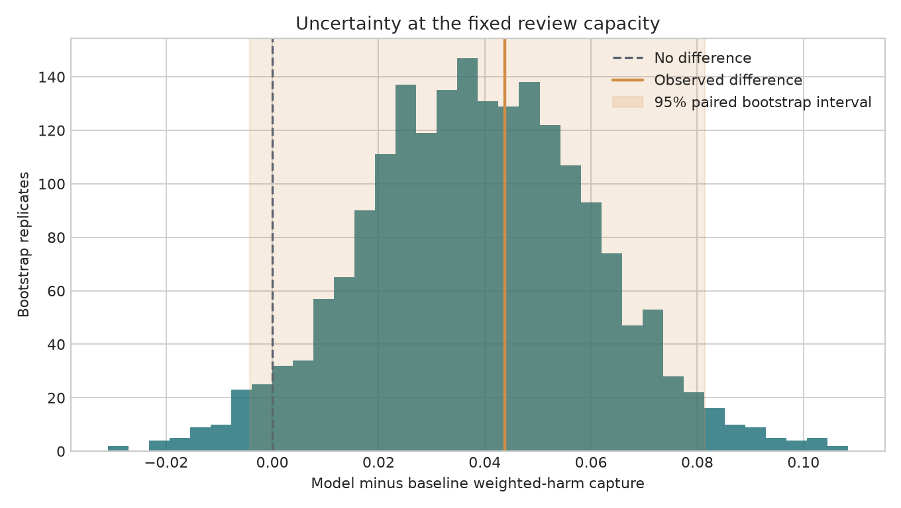
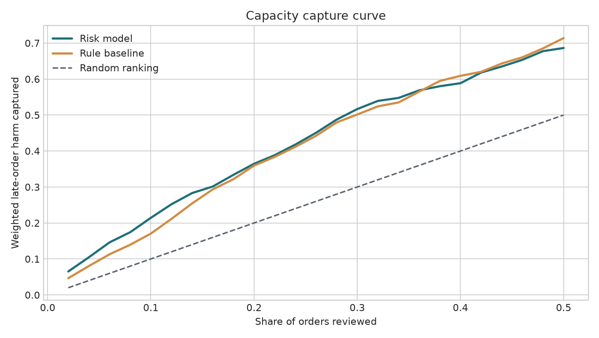
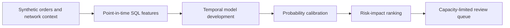
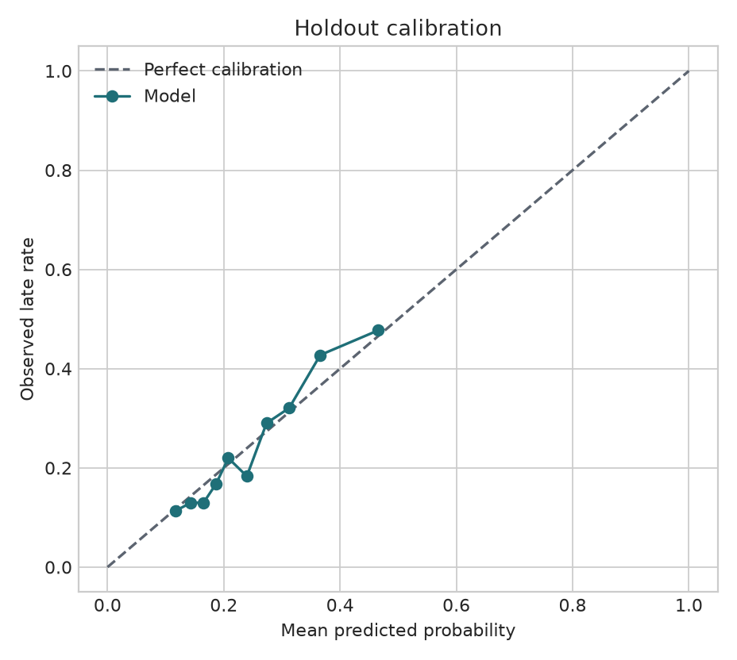
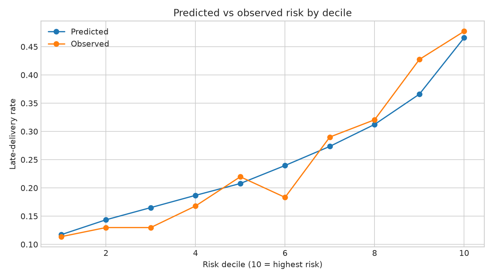
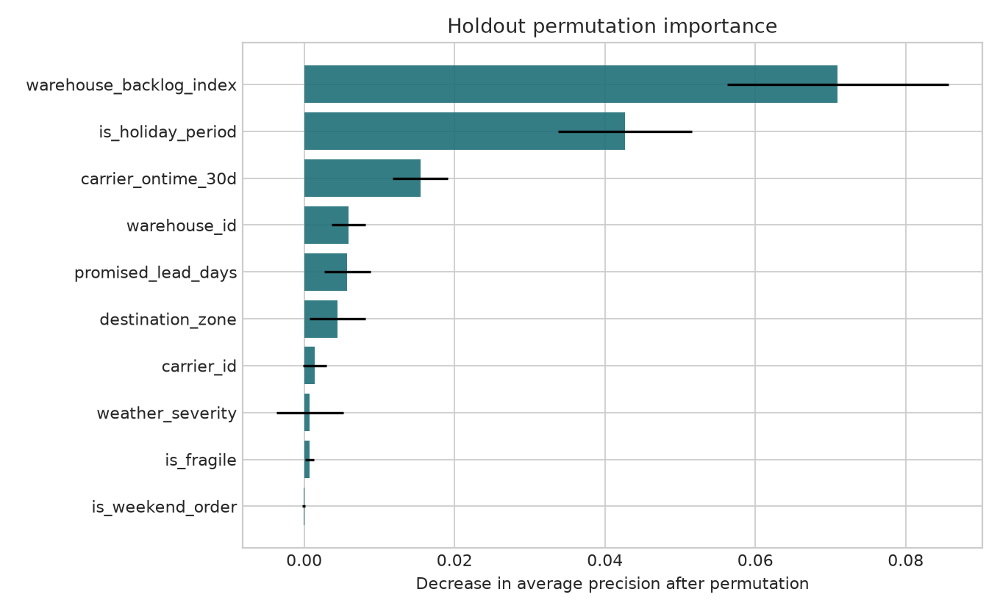

# Ecommerce Delivery Risk Decision System

[](https://github.com/parisaMSTFV/ecommerce-delivery-risk-decision-system/actions/workflows/ci.yml)


[](LICENSE)

An end-to-end decision system that estimates late-delivery risk at order routing time and converts the estimate into a capacity-constrained review queue for ecommerce operations.

> All orders, customers, warehouses, carriers, network conditions, and results are synthetic. Executed metrics validate this implementation on a controlled fixture; they are not claims about production accuracy or business impact.

## Executed management decision

**Shadow-test the model queue and keep the rule baseline as fallback.** At 10% review
capacity, the model captured 21.4% of weighted late-order harm versus 17.1% for the
baseline: a **+4.4 percentage-point** difference. A paired day-block bootstrap gives a
95% interval from **-0.4 to +8.1 percentage points**, so the advantage does not exclude
zero. The model also has lower holdout average precision: **0.389 versus 0.417**.

The fixed `fixed-capacity-rule-v1` therefore does not authorize replacement of the
baseline. The evidence supports a later shadow evaluation, not automatic adoption.

[Executed decision report](reports/executive_summary.md) ·
[Bootstrap evidence](reports/paired_policy_bootstrap.csv)



## The decision

An operations team cannot manually inspect every active order. The useful question is:

**Which orders should enter a limited review queue before dispatch, given both late-delivery risk and the potential customer impact of a delay?**

The project separates three layers:

1. **Prediction:** estimate the probability that an order will arrive after its promise timestamp.
2. **Calibration:** map the model score to an interpretable probability using a later time period.
3. **Policy:** rank orders by risk multiplied by an explicit impact weight, then enforce a fixed review capacity.

The final output is a triage queue. It does not assume that reviewing, expediting, rerouting, or contacting the customer will prevent a delay.

## Executed holdout results

The final November-December 2025 holdout was excluded from model selection, fitting, and probability calibration. It contains 1,313 synthetic orders, including 323 late deliveries.

| Metric | Model-based policy | Rule baseline |
|---|---:|---:|
| Average precision | 0.389 | **0.417** |
| ROC AUC | **0.680** | 0.678 |
| Precision at 10% review capacity | **47.7%** | 35.6% |
| Late orders captured at 10% capacity | **19.5%** | 14.6% |
| Weighted late-order harm captured | **21.4%** | 17.1% |

The model did not beat the baseline on holdout average precision. It did produce a better decision queue at the stated 10% capacity: weighted harm capture was **1.26x** the baseline. This distinction matters because the operational decision is a constrained ranking problem, not an unconstrained classification exercise.

The paired day-block bootstrap estimates the model-minus-baseline weighted-harm
capture difference at **+4.4 percentage points**, with a 95% interval from **-0.4 to
+8.1 percentage points**. The interval includes zero. Although 96.1% of the 2,000
bootstrap replicates were positive, that share is descriptive and is not a posterior
probability that the model is better.

The model had beaten the baseline on the earlier tuning period (average precision 0.191 vs 0.174). The reversal on the final seasonal holdout is reported rather than hidden; it is evidence that monitoring and fallback rules are necessary.




## Workflow



The decision timestamp is after warehouse and carrier assignment but before dispatch. Only attributes available by that point enter the model. Actual delivery time is used only to create the evaluation label.

## Temporal evaluation design

| Partition | Dates | Orders | Purpose |
|---|---|---:|---|
| Train | 2024-01-01 to 2025-04-30 | 9,866 | Fit candidate model |
| Tuning | 2025-05-01 to 2025-08-31 | 2,572 | Compare model with baseline |
| Calibration | 2025-09-01 to 2025-10-31 | 1,249 | Fit probability calibration |
| Holdout | 2025-11-01 to 2025-12-31 | 1,313 | One final evaluation |

The gradient-boosting model is refit on train plus tuning data after the design is fixed. A one-dimensional logistic calibrator is then fitted on the separate calibration period.

## Data and point-in-time features

The generator creates 15,000 fictional orders and daily context for three fictional warehouses and four fictional carriers. Features include:

- order value, item count, weight, volume, fragility, destination zone, and promised lead time;
- warehouse backlog and available capacity at the decision date;
- carrier on-time rate, weather severity, holiday period, order hour, and weekend status.

`sql/build_features.sql` performs the point-in-time join and derives the label. The model feature list explicitly excludes actual delivery time, promise time, and the outcome label. See [data provenance](DATA_PROVENANCE.md) and the [data dictionary](docs/DATA_DICTIONARY.md).

## Decision policy

The model probability is multiplied by a transparent impact weight:

$$
Impact = 1 + 0.45(Premium) + 0.35\frac{\log(1 + Value)}{\log(1401)} + 0.20(Fragile)
$$

Orders are ranked by `predicted_late_risk × impact_weight`:

- top 10%: `priority_review`;
- next 15%: `monitor`;
- remaining 75%: `standard_flow`.

These weights and capacities are configurable policy assumptions. They are not causal estimates of preventable harm. See the [decision policy](docs/DECISION_POLICY.md).

## Model behavior

The calibrated holdout probabilities reached a Brier score of 0.172 and expected calibration error of 0.028.





Permutation importance is calculated on the final holdout for diagnostic interpretation only; it is not used to revise the model.



## Reproduce the project

```bash
git clone https://github.com/parisaMSTFV/ecommerce-delivery-risk-decision-system.git
cd ecommerce-delivery-risk-decision-system
python -m venv .venv
```

Activate the environment:

```bash
# macOS / Linux
source .venv/bin/activate

# Windows PowerShell
.venv\Scripts\Activate.ps1
```

Install and run:

```bash
python -m pip install -e ".[dev]"
python scripts/run_pipeline.py
python -m pytest -q
```

The pipeline regenerates the synthetic inputs, point-in-time feature table, holdout scores, decision queue, metrics, report, and figures. The committed synthetic-data fingerprint is `3caad89899ef1c02`.

## Repository map

| Path | Purpose |
|---|---|
| `src/delivery_risk/` | Data generation, SQL orchestration, model, calibration, policy, evaluation, and reporting |
| `sql/build_features.sql` | Executed point-in-time feature and label query |
| `configs/pipeline.json` | Dates, random seed, model settings, and capacity rules |
| `data/` | Generated synthetic raw inputs |
| `artifacts/` | Feature table, holdout scores, review queue, deciles, and importance |
| `reports/` | Machine-readable metrics, executed summary, and figures |
| `tests/` | Data, leakage-boundary, temporal-split, policy, and output tests |
| `.github/workflows/ci.yml` | Python 3.11/3.12 lint, test, reproduction, and safety checks |

## Quality controls

The test suite checks:

- deterministic generation and unique synthetic identifiers;
- valid order, promise, and delivery timestamps;
- exclusion of outcome fields from model features;
- strict temporal partition boundaries;
- exact review-capacity enforcement;
- deterministic paired day-block bootstrap and fixed decision-rule behavior;
- consistency between machine-readable metrics and scored artifacts;
- synthetic-only publication safety.

GitHub Actions runs Ruff, the complete pipeline, Pytest, and the sensitive-content scan on Python 3.11 and 3.12.

## Limitations

- Synthetic behavior cannot establish production accuracy, business value, or real network dynamics.
- The final holdout contains only two peak-season months; it is not evidence of year-round stability.
- The bootstrap resamples observed holdout dates; it does not cover model refitting, a new season, or impact-weight uncertainty.
- Holdout average precision was below the rule baseline even though the fixed-capacity queue performed better.
- The impact formula reflects explicit priorities, not measured customer harm or treatment effect.
- Reviewing an order is not the same as preventing a delay; intervention effectiveness requires an experiment or credible causal design.
- Carrier on-time rate and warehouse context would need strict point-in-time contracts in production.
- No fairness, route-capacity, or downstream intervention-cost constraint is optimized.

## Documentation

- [Methodology](docs/METHODOLOGY.md)
- [Model card](docs/MODEL_CARD.md)
- [Decision policy](docs/DECISION_POLICY.md)
- [Data dictionary](docs/DATA_DICTIONARY.md)
- [Executed decision report](reports/executive_summary.md)
- [Interview guide](docs/INTERVIEW_GUIDE.md)

## Author

Parisa Mostafavi · [LinkedIn](https://www.linkedin.com/in/parisa-mostafavi/)
